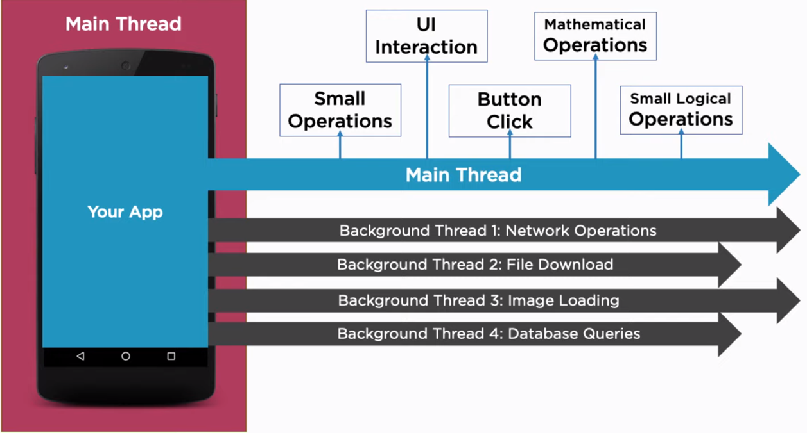
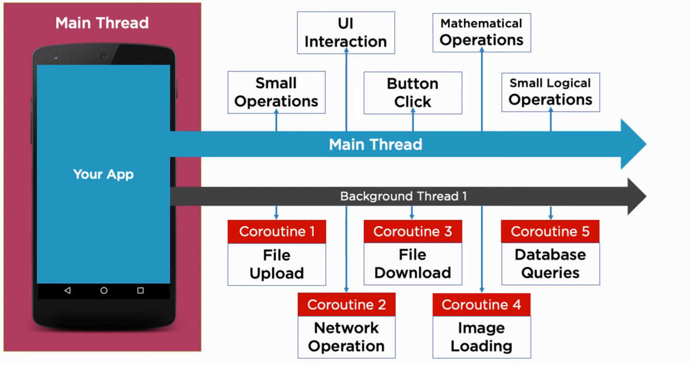

# Coroutines

## Overview

* Provided by Kotlin to support and simplify the manage of asynchronous operation.
* Coroutines are asynchronous but _not necessarily_ multi threaded.

## Coroutines vs Threads
| Coroutine                             | Threads               |
| ------------------------------------- | --------------------- |
| Lightweight threads                   | Expensive             |
| Managed by user                       | Managed by OS         |
| No context switching on processors    | Threads are blocking  |



*Threads*



*Coroutines*

## Coroutines Builder

* Coroutine have to be 'managed'. To manage a coroutine, it has to be launched inside a context which we called _builder_.
* The job of coroutine builder is launches a new coroutine concurrently with the rest of code.

#### `launch`
```kotlin
launch {
    delay(1000) 
    // delay is Kotlin suspending function to pause the coroutine without blocking the thread, 
    // so that thread can now be used for other coroutines while this coroutine is paused.
    println("Hello")
}
```

* `launch` simply returns a `Job` object
* Fire and forget type, can't return data 

#### `async`

* `async` returns a `Deferred` object (like `promise` and `future` in other language)
* Perform task and return result

#### `runBlocking`

* `runBlocking` is a coroutine builder that runs a coroutine code, but blocks the main thread until the coroutine itself is finished.
* runBlocking can return a type
* Common place to use runBlocking is when you're writing test


## Suspend Function
* A function with suspend modifier executes the code without blocking the thread where its running.
* Only allowed to be called from coroutine blocks or other suspend function.

## Dispatcher
* Coroutine context / builder provide a _Coroutine dispatcher_.
* A Dispatcher determines which thread the coroutine is run on.